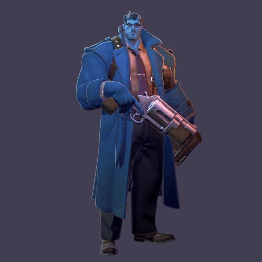
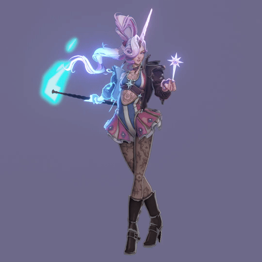

# Deadlock Blender Shader for 5.2+

[Video guide](https://www.youtube.com/watch?v=oINnkEs8c98) explaining the usage and setup

Should you have any questions feel free to ask in my [Discord](https://discord.gg/wRaNPBg98s) or AerthasVeras [Discord](https://discord.gg/EkCSZg8)

 
 

______________________________________________________

A big thank you goes out to everyone who helped with this project

Testers:

[MayaIsAnimating](https://x.com/MayaIsAnimating)

[Miruneko](https://x.com/m1ru_neko)

Development:

[CrypticLight](https://x.com/TheCrypticLight)

[Ijiru](https://x.com/ijiru_masu)

[AerthasVeras](https://x.com/AerthasVeras)

[Spartandraws](https://bsky.app/profile/spartandrawssfw.bsky.social)

Thumbnail:

[SupraShade](https://bsky.app/profile/suprashasde.bsky.social)

Lovely - Deadlock Graphical Library in the official deadlock server

[lyncpk](https://x.com/lyncpk)
